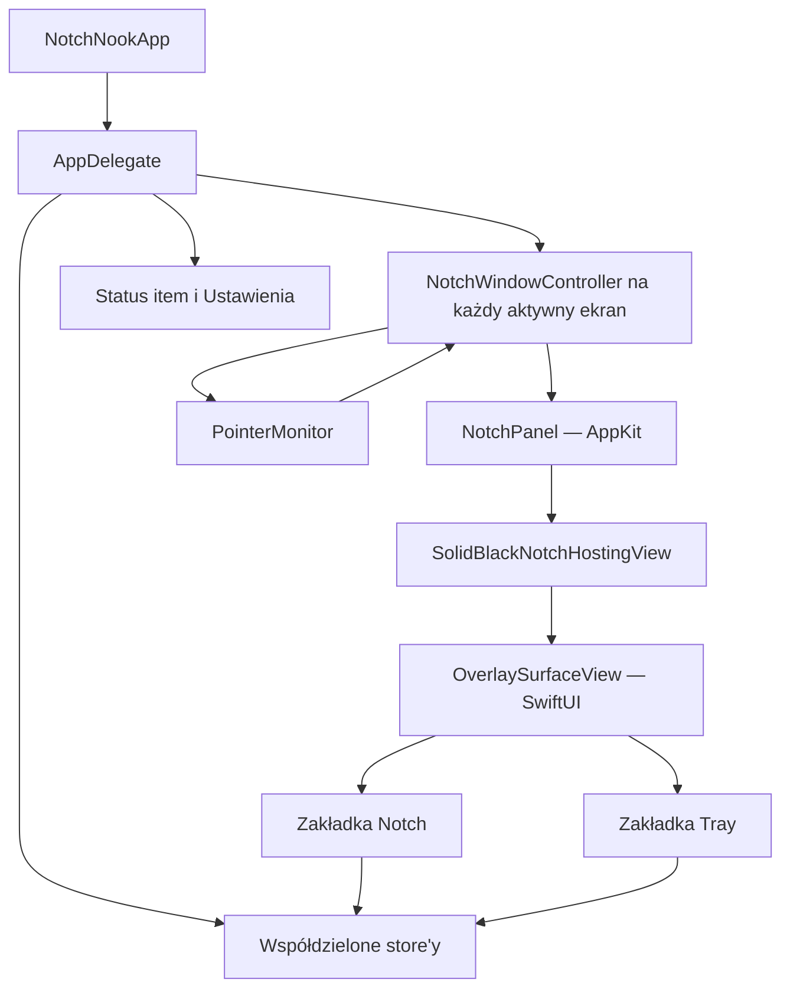
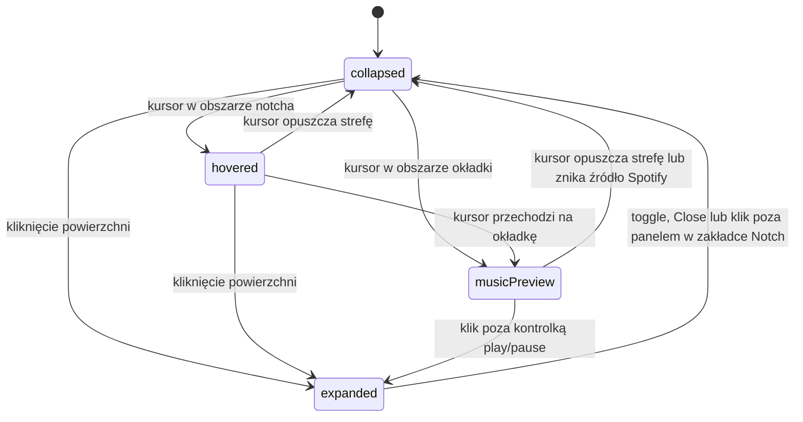

# NotchNook — pełny kontekst aplikacji

> Dokument opisuje **faktyczny stan bieżącej implementacji**, ustalony na podstawie kodu źródłowego. Jest przeznaczony przede wszystkim dla kolejnego agenta lub programisty, który ma szybko zrozumieć produkt, architekturę, stany interfejsu i odpowiedzialność poszczególnych widoków.
>
> Pliki `PLAN_BUDOWY_NOTCH_APP.md`, `notchnook-specyfikacja.pdf` i `NotchNook_UI_Teardown.pdf` opisują również kierunek produktu. Nie wszystkie funkcje z tych materiałów są już dostępne. Rozdział „Zakres faktycznie zaimplementowany” jest źródłem prawdy o aktualnym stanie aplikacji.

## 1. Czym jest NotchNook

NotchNook to natywne narzędzie dla macOS, które wykorzystuje fizyczny notch MacBooka — albo rysuje jego wirtualny odpowiednik na ekranie bez wycięcia — jako stale dostępny, kontekstowy panel.

Aplikacja:

- działa jako proces akcesoryjny bez ikony w Docku (`LSUIElement` i `activationPolicy(.accessory)`),
- umieszcza czarną powierzchnię na środku górnej krawędzi ekranu,
- reaguje na najechanie, kliknięcie i przeciąganie plików,
- po otwarciu pokazuje konfigurowalne komponenty oraz trwały Tray na pliki,
- może tworzyć niezależną nakładkę na każdym podłączonym ekranie,
- udostępnia ikonę i menu w pasku menu,
- używa połączenia AppKit i SwiftUI zamiast klasycznego okna aplikacji.

Głównym celem produktu jest zapewnienie szybkiego dostępu do małych informacji i akcji bez otwierania pełnowymiarowej aplikacji. Notch ma wyglądać jak część sprzętu, a po interakcji płynnie zmieniać się w panel roboczy.

## 2. Zakres faktycznie zaimplementowany

### Dostępne obecnie

- fizyczny notch lub wirtualny handler na górze ekranu,
- cztery stany powierzchni: `collapsed`, `hovered`, `musicPreview`, `expanded`,
- animowana tęczowa poświata w stanach hover,
- jednorazowy haptic przy wejściu kursora w obszar notcha,
- kompaktowy podgląd Spotify i pełny komponent Spotify,
- zakładka `Notch` z konfigurowalnymi komponentami,
- zakładka `Tray` przyjmująca pliki i foldery przez drop,
- komponenty: Muzyka, Skróty, Zadania, Agenci AI i Kalendarz,
- placeholdery komponentów Lustro i System,
- trwałe ustawienia panelu w `UserDefaults`,
- trwałe dane zadań w `UserDefaults`,
- trwałe kopie elementów Tray w `Application Support`,
- osobne nakładki na ekranach zewnętrznych,
- menu paska menu i osobne okno Ustawień.

### Jeszcze niezaimplementowane albo tylko częściowe

- komponent `Lustro` nie uruchamia kamery; pokazuje ogólną kartę-placeholder,
- komponent `System` nie odczytuje stanu urządzenia; pokazuje kartę-placeholder,
- z elementów Tray można przeciągnąć plik/folder do innej aplikacji (AppKit `NSDraggingSource`, kopia) oraz skopiować przez menu kontekstowe,
- Tray nie ma akcji „wyczyść wszystko” ani AirDrop,
- nie ma osobnego Drop Mode ze strefami kontekstowymi,
- Live Activities (Dynamic Island) dla agentów/zadań są zaimplementowane jako osobny bubble po prawej stronie notcha,
- nie ma gestów trackpada,
- testy automatyczne nie zastępują manualnej walidacji zachowania w fullscreen, Spaces, Mission Control, Stage Manager oraz zachowania focusu.

## 3. Wymagania i uruchamianie

- macOS 14.6 lub nowszy,
- Swift 6,
- Xcode 16+ do pełnego developmentu i testów XCTest,
- aplikacja jest zbudowana jako executable Swift Package.

Podstawowe polecenia:

```bash
./scripts/run-core-checks.sh
./scripts/package-app.sh debug
open build/NotchNook.app
```

`run-core-checks.sh` kompiluje produkcyjną logikę geometrii i uruchamia zestaw asercji bez zależności od XCTest. `swift test` jest właściwym zestawem testów, gdy aktywne narzędzia Xcode udostępniają XCTest.

`package-app.sh`:

1. buduje pakiet przez `swift build`,
2. składa `build/NotchNook.app`,
3. kopiuje `Info.plist`,
4. podpisuje aplikację lokalnym podpisem ad-hoc.

## 4. Architektura wysokiego poziomu



### Warstwa AppKit

Odpowiada za cykl życia aplikacji, ekrany, geometrię, `NSPanel`, poziom okna, Spaces/fullscreen, globalne zdarzenia kursora, status item, haptics i zwykłe okno Ustawień.

Najważniejsze typy:

- `AppDelegate` — composition root aplikacji,
- `NotchGeometryResolver` — rozpoznanie fizycznego notcha lub utworzenie wirtualnego handlera,
- `NotchWindowController` — automat stanów i geometria jednej nakładki,
- `NotchPanel` — nieaktywujący panel,
- `PointerMonitor` — globalny i lokalny monitoring myszy,
- `SolidBlackNotchHostingView` — host SwiftUI z natywną czarną warstwą `CAShapeLayer`.

### Warstwa SwiftUI

Odpowiada za wygląd powierzchni, zakładki, komponenty, listy, przyciski, formularz Ustawień i animacje treści.

### Store'y

`AppDelegate` tworzy po jednej współdzielonej instancji:

- `SettingsStore`,
- `TrayStore`,
- `SpotifyMusicStore`,
- `TaskStore`,
- `CalendarStore`,
- `AgentMonitorStore`.

Wszystkie nakładki ekranowe korzystają z tych samych danych. Każdy `NotchWindowController` posiada jednak własny `OverlayPresentationModel`, dlatego stan otwarcia i wybrana zakładka są niezależne dla każdego ekranu.

## 5. Cykl życia aplikacji

### Start

Po `applicationDidFinishLaunching` aplikacja:

1. przechodzi w tryb akcesoryjny bez Docka,
2. rozpoczyna monitoring Spotify,
3. rozpoczyna monitoring agentów AI,
4. pobiera listę Skrótów macOS,
5. rejestruje reakcje na zmianę ustawień geometrii i polityki ekranów,
6. obserwuje podłączenie, odłączenie i zmianę parametrów ekranów,
7. tworzy odpowiednie nakładki,
8. tworzy ikonę w pasku menu,
9. po około 0,8 s próbuje zsynchronizować Spotify i uzyskać potrzebny dostęp Automation.

### Zmiana ekranów

Przy zmianie konfiguracji ekranów `rebuildOverlays()` porównuje oczekiwane ekrany z aktywnymi kontrolerami. Niepotrzebne nakładki są zamykane, istniejące odświeżane, a brakujące tworzone.

Domyślnie aktywny jest ekran wbudowany. Jeżeli nie istnieje, używany jest pierwszy ekran zwrócony przez `NSScreen.screens`. Po włączeniu obsługi ekranów zewnętrznych nakładka powstaje na każdym ekranie.

### Zakończenie

Przy zamykaniu aplikacja zatrzymuje monitoring Spotify i kursora, usuwa obserwatora ekranów oraz zamyka wszystkie nakładki.

## 6. Model stanów głównej powierzchni

Najważniejszym automatem jest `NotchWindowController.SurfaceState`.



### 6.1. `collapsed` — stan zwinięty

To stan spoczynkowy.

- Panel jest przyklejony do środka górnej krawędzi ekranu.
- Bez aktywnego Spotify jest czarną, pustą powierzchnią dopasowaną do fizycznego notcha lub wirtualnego handlera.
- Z aktywnym utworem powierzchnia rozszerza się symetrycznie i pokazuje miniokładkę po lewej oraz wskaźnik odtwarzania po prawej.
- Kliknięcie zwykłej części powierzchni otwiera `expanded`.
- Kliknięcie prawej strefy play/pause steruje Spotify bez otwierania panelu.
- Najechanie uruchamia `hovered` albo bezpośrednio `musicPreview`, jeśli kursor wszedł w strefę okładki.

Geometria:

- szerokość bazowa: `max(szerokość anchora, 120)`,
- przy aktywnym Spotify: dodatkowe 100 pt,
- wysokość: `max(wysokość anchora, 12)`.

W zwiniętym stanie z aktywnym Spotify host pozostaje szerszy, ale czarna powierzchnia jest poziomo skalowana współczynnikiem `280/300`. Dzięki temu treść ma stałe punkty odniesienia, a powierzchnia może rozszerzyć się na hover bez przesuwania okładki i wskaźnika.

### 6.2. `hovered` — zwykłe najechanie

Stan lekkiego podkreślenia interakcji.

- Bez Spotify powierzchnia rośnie o 40 pt na szerokość i 20 pt w dół.
- Z aktywnym Spotify szerokość hosta pozostaje taka jak w `collapsed`, ale czarne tło przechodzi ze skali `280/300` do pełnej szerokości; wysokość rośnie o 20 pt.
- Jeśli w Ustawieniach aktywna jest poświata, pojawia się animowany tęczowy obrys tylko na bokach i dole.
- Górna krawędź nie jest obrysowywana, aby powierzchnia wizualnie łączyła się z fizycznym notchem.
- Przy wejściu wykonywany jest jeden haptic typu alignment. Kolejne ruchy wewnątrz nie powtarzają go.
- Opuszczenie strefy przywraca `collapsed`.

### 6.3. `musicPreview` — pogłębiony podgląd muzyki

Stan dostępny tylko przy aktywnym źródle Spotify.

- Powstaje po najechaniu na lewą, 46-punktową strefę okładki.
- Szerokość jest taka jak w kompaktowym stanie Spotify.
- Wysokość rośnie o 64 pt względem anchora.
- Okładka powiększa się z 24 do 28 pt i przesuwa niżej.
- Pojawia się wiersz `tytuł • album • artysta`.
- Po 1 sekundzie tekst rozpoczyna ciągłe przewijanie od prawej do lewej.
- Poświata działa tak samo jak w `hovered`.
- Kliknięcie okładki lub środkowej strefy otwiera pełny panel.
- Kliknięcie prawej górnej strefy steruje play/pause i nie otwiera panelu.
- Utrata aktywnego utworu natychmiast przywraca `collapsed`.

### 6.4. `expanded` — pełny panel

Pełna powierzchnia ma 204 pt wysokości i szerokość wynikającą z Ustawień, ograniczoną do szerokości ekranu minus 48 pt.

Widok zawiera:

- dekoracyjny uchwyt w formie kapsuły,
- przełącznik zakładek `Notch` / `Tray`,
- przycisk zębatki otwierający Ustawienia,
- zawartość aktualnej zakładki,
- dodatkowy przycisk `Close` tylko w zakładce Tray.

W tym stanie hover nie zmienia geometrii i nie pokazuje poświaty.

## 7. Drugi poziom stanu: zakładki pełnego panelu

`OverlayPresentationModel.ExpandedTab` ma dwa przypadki:

### 7.1. `notch`

Pokazuje skonfigurowane komponenty w jednym poziomym wierszu. Kliknięcie poza panelem zwija powierzchnię. Zdarzenie nie jest konsumowane, więc klik dociera również do aplikacji znajdującej się pod kursorem.

### 7.2. `tray`

Pokazuje półkę na pliki. Kliknięcia poza panelem **nie zamykają** powierzchni, ponieważ użytkownik ma móc przejść do Findera lub innej aplikacji i przeciągnąć plik do Tray. Do zamknięcia służy przycisk `Close`, toggle z menu lub programowe `Collapse`.

Wybrana zakładka nie jest resetowana podczas zwijania. Ponowne otwarcie danej nakładki pokazuje ostatnio wybraną zakładkę. Stan ten nie jest zapisywany między uruchomieniami aplikacji.

## 8. Obsługa kursora i kliknięć

`PointerMonitor` instaluje lokalny i globalny monitor dla:

- ruchu myszy,
- lewego, prawego i środkowego kliknięcia,
- przeciągania wszystkimi przyciskami.

Monitor nie przejmuje zdarzeń — lokalny handler zawsze zwraca oryginalne zdarzenie. Dzięki temu klik poza otwartym Notchem może go zamknąć, a jednocześnie wykonać akcję w aplikacji pod spodem.

Obszar hover jest trochę większy od widocznego panelu:

- `collapsed`: frame poszerzony o 10 pt poziomo i 8 pt pionowo,
- `hovered`: frame poszerzony o 12 pt poziomo i 10 pt pionowo,
- `musicPreview`: analogicznie 12/10 pt,
- `expanded`: brak strefy hover.

Ważne wyjątki:

- prawa kontrolka odtwarzania jest wyłączona z reguły otwierającej pełny panel w `collapsed` i `musicPreview`,
- w stanie `hovered` klik traktowany jest jak klik powierzchni i otwiera panel,
- każde kliknięcie poza `expanded` zamyka panel tylko wtedy, gdy aktywna jest zakładka `Notch`.

## 9. Okno i rendering powierzchni

Każda nakładka jest `NotchPanel`, czyli `NSPanel`:

- borderless,
- nonactivating,
- nie może stać się key ani main window,
- ma przezroczyste tło i nie ma systemowego cienia,
- znajduje się poziom wyżej niż `statusBar`,
- nie znika po dezaktywacji aplikacji,
- używa `.canJoinAllSpaces`, `.fullScreenAuxiliary` i `.stationary`.

Panel jest przezroczysty, ale `SolidBlackNotchHostingView` rysuje pod SwiftUI natywną, nieprzezroczystą warstwę `CAShapeLayer` w kolorze sRGB `#000000`. Jej kształt, promienie i skala są synchronizowane ze SwiftUI. Piksele poza ścieżką notcha pozostają przezroczyste.

Promienie powierzchni:

| Stan | Dolny promień | Promień ramion |
|---|---:|---:|
| `collapsed` | 8 | 7 |
| `hovered` | 13 | 11 |
| `musicPreview` | 22 | 16 |
| `expanded` | 30 | 18 |

Animacje respektują systemowe Reduce Motion. Standardowe czasy przejść wynoszą około 0,14 s, 0,22 s dla podglądu muzyki i 0,28 s dla otwarcia. Przy Reduce Motion kontroler używa krótkiego przejścia 0,1 s, a część animacji SwiftUI zostaje zatrzymana lub skrócona.

## 10. Widok `Notch` i układ komponentów

Komponenty zajmują poziomy wiersz o wysokości 112 pt. Ich szerokości są proporcjonalne do `widthWeight`. Między kartami znajdują się 17-punktowe separatory: wizualne na co dzień, a gdy otwarte jest okno Ustawień — interaktywne uchwyty do przeciągania (`SettingsStore.adjustDivider`).

Minimalna wymagana szerokość jest obliczana jako:

```text
48 pt paddingu
+ 17 pt × liczba separatorów
+ 184 pt × suma wag komponentów
```

Wynik jest ograniczony do zakresu 520–1800 pt. Dodanie komponentu lub zwiększenie wag może automatycznie zwiększyć zapisaną szerokość panelu. Na małym ekranie końcowy frame i tak zostanie ograniczony do `szerokość ekranu - 48 pt`.

Domyślna kolejność na czystej instalacji:

1. Muzyka — waga 1,5,
2. Skróty — 1,15,
3. Zadania — 1,25,
4. Agenci AI — 2,0,
5. Kalendarz — 1,0,
6. System — 1,0.

Każdy rodzaj komponentu może wystąpić najwyżej raz. Nie można usunąć ostatniego komponentu.

## 11. Konkretne widoki i ich zachowanie

### 11.1. Kompaktowa powierzchnia bez muzyki

Nie pokazuje tekstu ani kontrolek. Jest tylko punktem wejścia. Hover rozszerza ją i pokazuje opcjonalną poświatę, a klik otwiera panel.

### 11.2. `NowPlayingSurface` — kompaktowe Spotify

Jest renderowany wyłącznie poza `expanded` i tylko, gdy `SpotifyMusicStore.hasActiveTrack == true`.

Widok ma trzy logiczne strefy:

- lewa — okładka i otwarcie panelu; hover uruchamia `musicPreview`,
- środkowa — otwarcie pełnego panelu,
- prawa górna — play/pause,
- prawa dolna — otwarcie panelu.

Okładka i wskaźnik odtwarzania mają stałe pozycje w hoście, aby nie skakały podczas animacji czarnego tła. Wskaźnik pokazuje animowane trzy słupki dla odtwarzania albo ikonę play dla pauzy. Reduce Motion zatrzymuje animację słupków.

### 11.3. `MusicComponentView` — pełny komponent Muzyka

Pokazuje:

- okładkę 82 × 82 pt z badge Spotify,
- tytuł,
- album,
- artystę,
- poprzedni utwór,
- play/pause,
- następny utwór.

Komponent odświeża store co 2 sekundy podczas swojej obecności. Niezależnie od tego globalny monitoring Spotify działa co 1 sekundę przez cały czas życia aplikacji.

Jeżeli Spotify nie działa, użycie dowolnej komendy próbuje otworzyć URL `spotify:`. Widok wtedy prezentuje stan zastępczy. Jeżeli macOS odmówi Automation, tekst wskazuje ścieżkę do ustawień Prywatności.

### 11.4. `ShortcutsComponentView` — Skróty macOS

Pokazuje pionowy stos skonfigurowanych przycisków. Wysokość każdego przycisku jest proporcjonalna do jego wagi.

- Lista dostępnych skrótów pochodzi z `/usr/bin/shortcuts list`.
- Kliknięcie uruchamia `/usr/bin/shortcuts run <nazwa>` poza głównym wątkiem.
- Podczas działania jednego skrótu pozostałe przyciski są wyłączone.
- Aktywny przycisk pokazuje spinner.
- Błąd jest prezentowany u dołu komponentu.
- Brak konfiguracji pokazuje pusty stan z instrukcją przejścia do Ustawień.

Nazwy `Haos`, `Apps` i `Odliczanie dni` otrzymują specjalne ikony i gradienty. Pozostałe skróty korzystają ze stylu ogólnego. Jest to wyłącznie decyzja prezentacyjna — wykonanie każdego skrótu działa identycznie.

### 11.5. `TaskComponentView` — Zadania

Lokalna lista prostych zadań.

Stany widoku:

- pusta lista — komunikat „Brak zadań”,
- dodawanie — pole u góry i przycisk plus,
- zwykły wiersz — tytuł i puste kółko,
- ukończony wiersz — wypełnione kółko, checkmark, przygaszony i przekreślony tytuł,
- edycja — pole tekstowe z przyciskami zapisu i anulowania.

Kliknięcie wiersza oznacza zadanie jako wykonane. Po 1 sekundzie zadanie jest usuwane z listy animacją w prawo. Menu kontekstowe udostępnia Edycję i Usunięcie. Puste lub zawierające same białe znaki tytuły są ignorowane.

Lista jest przechowywana w `UserDefaults`. Podczas startu ukończone rekordy pozostałe po przerwanym opóźnieniu są odfiltrowywane i usuwane z zapisu.

### 11.6. `CalendarComponentView` — Kalendarz

Widok składa się z:

- skrótu bieżącego miesiąca,
- siedmiu dni: wybrany dzień i po trzy dni z każdej strony,
- listy wydarzeń wybranego dnia.

Stany domenowe:

- dostęp `notDetermined` — przycisk prosi o pełny dostęp do kalendarzy,
- trwa prośba — spinner i „Łączenie z Kalendarzem…”,
- brak dostępu / odmowa — przycisk otwiera systemowe ustawienia Prywatności Kalendarza,
- pełny dostęp i brak wydarzeń — pusty stan,
- pełny dostęp i wydarzenia — przewijana lista posortowana według rozpoczęcia.

Wiersz wydarzenia pokazuje kolor kalendarza, tytuł i godzinę startu albo „cały dzień”. Store obserwuje `EKEventStoreChanged`, więc odświeża dane po zmianach w systemowym Kalendarzu. Prośba o uprawnienie pojawia się dopiero po pokazaniu komponentu i akcji użytkownika.

### 11.7. `AgentMonitorComponentView` — Agenci AI

Pokazuje po jednym wierszu dla:

- Codex,
- Google Antigravity,
- Cursor.

Każdy wiersz ma ikonę aplikacji i trzy liczniki:

- niebieski — `working`,
- pomarańczowy — `waitingForUser` (UI: `stopped`),
- zielony — `completed` (UI: `done`).

Dynamic Island / agregat pokazuje jeden bucket z priorytetem: pomarańczowy → niebieski → zielony (jeśli `stopped > 0`, zawsze pomarańczowy).

#### Fabryka interfejsów narzędzi

Monitor jest zbudowany wokół pluggable kontraktu w `NotchApp/Features/Agents/Interfaces/`:

| Typ | Rola |
|---|---|
| `AgentToolFactory` | buduje zestaw narzędzi produkcyjnych (`makeDefaultTools`) albo pojedynczy tool (`make(provider:)`) |
| `AgentToolInterface` | kontrakt jednego narzędzia: `provider`, `capabilities`, `adapter`, `signalMonitor`, `mapHookEvent` |
| `AgentToolStatus` | natywny status narzędzia z projekcją `canonicalStatus` → `AgentStatus` / `AgentActivityState` |
| `AgentToolSignalMonitor` | start/stop watcherów; po zmianie na dysku wywołuje `onChange` → resync |
| `FileSystemAgentSignalMonitor` | wspólna implementacja FS watchera (debounce ~120 ms, re-attach po delete/rename) |
| `CursorToolInterface` / `CodexToolInterface` / `AntigravityToolInterface` | konkretne narzędzia |

`AgentMonitorStore` nie zna szczegółów Cursora/Codexa/Antigravity — operuje wyłącznie na `AgentToolInterface`. Testy mogą wstrzyknąć własne tools albo legacy `adapters:` (opakowane w `AdapterOnlyToolInterface` bez FS monitora).

Natywne enumy statusów (mapowane na kanoniczny `AgentStatus`):

- `CursorAgentStatus` — m.in. `generating` / `unfinishedRun` → `working`; `awaitingApproval` / `blocked` / `waiting` → `waitingForUser`; `completed` / `aborted` (bez niedokończonego runu) → `completed`,
- `CodexAgentStatus` — `task_started` / `turn_started` → `working`; approval / elicitation / `turn_aborted` → `waitingForUser`; `task_complete` / `turn_complete` → `completed`,
- `AntigravityAgentStatus` — liczbowe `StepStatus` (1/2 → `working`, 4/5/6/7 → `waitingForUser`, 3 → `completed`).

#### Architektura runtime

- `ApplicationPresenceMonitor` (NSWorkspace + bundle ID) wykrywa start/stop aplikacji providera,
- po starcie: `signalMonitor.start()` + `adapter.start` + `adapter.resync()` → `AgentStateStore.replaceAgents`,
- po stopie: stop monitora i adaptera, wyczyszczenie stanu providera (liczniki UI = 0),
- adaptery (`CursorAdapter`, `CodexAdapter`, `AntigravityAdapter`) normalizują eventy i skanują dysk,
- `AgentStateStore` jest jedynym źródłem prawdy; liczniki i DI liczone ze snapshotów,
- IPC Unix socket (`~/Library/Application Support/NotchNook/agent-events.sock`) + CLI `agentbridge` przyjmują eventy z hooków; kind mapuje `tool.mapHookEvent` per provider,
- reconciliation ~1 s oraz sygnały `AgentToolSignalMonitor` naprawiają utracone eventy; `renderEpoch` wymusza odświeżenie SwiftUI bez czekania na hover.

#### Dane na dysku i watchery

| Provider | Źródła skanu | `watchTargets(for:)` |
|---|---|---|
| Codex | locki wątków, `~/.codex/state_5.sqlite`, końcówki rolloutów JSONL | katalog locków + katalog state DB |
| Cursor | `state.vscdb` (composerData + composerHeaders) | `state.vscdb` + `-wal` + `-shm` |
| Antigravity | `app_storage.json`, rozmowy w `~/.gemini/antigravity/conversations` | app storage + katalog conversations |

Mapowanie Cursor UI: `hasBlockingPendingActions` / `hasPendingPlan` → pomarańczowy (`waitingForUser`); `unfinishedRunAt` / `generating` / aktywne bubble → niebieski (`working`). Samo `status: aborted` bez niedokończonego runu nie jest pomarańczowe.

Jeżeli dana aplikacja nie działa, jej wiersz jest przygaszony, a liczniki wynoszą zero — niezależnie od wcześniejszego stanu runtime.

Skanowanie wykonuje się poza głównym wątkiem. Komponent tylko raportuje wykryty stan; nie steruje agentami ani nie modyfikuje ich danych.

#### Dodawanie kolejnego narzędzia AI

1. Dodać case do `AgentProvider` (tytuł, bundle ID, ścieżka aplikacji).
2. Dodać `*AgentStatus: AgentToolStatus` + `*ToolInterface: AgentToolInterface` w `Interfaces/<Tool>/`.
3. Zarejestrować w `AgentToolFactory.make(provider:)`.
4. Dodać adapter + resync w `Providers/<Tool>/` oraz ścieżki i `watchTargets(for:)` w `AgentMonitorPaths`.
5. Rozszerzyć mapowanie hooków (`mapHookEvent`) i testy (`AgentToolFactoryTests` + mapper/status).

### 11.8. Placeholdery `Mirror` i `SystemStatus`

Oba rodzaje można dodać w Ustawieniach, ale `componentCard` nie ma dla nich dedykowanej implementacji. Renderują ogólną kartę z ikoną, tytułem i opisem:

- Lustro — „Podgląd kamery”,
- System — „Stan urządzenia”.

Nie należy zakładać, że kamera albo monitoring systemu już działają.

### 11.9. `TrayView` — półka na pliki

Tray przyjmuje `URL` przez SwiftUI `dropDestination`.

Stany widoku:

- pusty — przerywana strefa drop i instrukcja,
- aktywny cel drop — fioletowe podświetlenie,
- ingest — animowana ikona i komunikat „Dodawanie plików…”,
- zawartość — pozioma lista kart plików,
- błąd — czerwony komunikat.

Po upuszczeniu każdy plik lub folder:

1. jest kopiowany do osobnego katalogu UUID,
2. otrzymuje metadane `TrayItem`,
3. jest dopisywany do indeksu JSON,
4. pozostaje dostępny po ponownym uruchomieniu.

Karta pokazuje systemową ikonę pliku, nazwę, rozmiar lub oznaczenie Folder oraz przycisk usunięcia. Usunięcie kasuje zarówno kopię z dysku, jak i rekord indeksu.

Kartę można przeciągnąć do Findera lub innej aplikacji przez natywny AppKit `NSDraggingSource` (`TrayItemDragHandle`) — SwiftUI `.draggable` nie startuje wiarygodnie z `nonactivatingPanel`. Menu kontekstowe oferuje „Kopiuj” oraz „Pokaż w Finderze”. Drop z powrotem na Tray ignoruje URL-e już zarządzane przez storage.

### 11.10. `SettingsRootView` — Ustawienia

To zwykłe, aktywujące okno macOS, w przeciwieństwie do nieaktywującego panelu notcha. Ma sekcje:

#### Rozmiar otwartego notcha

- suwak szerokości,
- zakres od wymaganej szerokości komponentów do 1800 pt,
- informację o automatycznym minimum i ograniczeniu na małych ekranach.

#### Wygląd

- włączenie lub wyłączenie tęczowej poświaty,
- poświata jest domyślnie włączona.

#### Ekrany

- opcja tworzenia notcha również na ekranach zewnętrznych,
- zmiana przebudowuje nakładki natychmiast.

#### Komponenty i podział przestrzeni

- dodawanie nieobecnego rodzaju komponentu,
- usuwanie z wyjątkiem ostatniego,
- przesuwanie w lewo i prawo,
- ustawianie względnej szerokości 0,5–3,0.

Zmian szerokości kart można dokonać suwakami w Ustawieniach albo przeciągając separatory w otwartym notchu, dopóki okno Ustawień jest widoczne (`allowsInteractiveComponentDividers`).

#### Przyciski z aplikacji Skróty

- dodawanie z wykrytej listy,
- odświeżenie listy,
- zmiana kolejności,
- usuwanie,
- względna wysokość 0,6–3,0.

Na pierwszym uruchomieniu bez zapisanej konfiguracji aplikacja automatycznie dodaje maksymalnie cztery pierwsze znalezione Skróty.

#### Aplikacja

- przycisk zakończenia NotchNook.

### 11.11. Menu paska menu

Ikona `rectangle.topthird.inset.filled` udostępnia:

- `Expand` — toggle tylko nakładki uznanej za główną,
- `Collapse` — zwinięcie wszystkich nakładek,
- nieaktywną informację o rodzaju głównego anchora i liczbie nakładek,
- `Copy Display Diagnostics` — kopiuje diagnostykę głównego ekranu do schowka,
- `Settings…`,
- `Quit NotchNook`.

## 12. Stany i logika Spotify

`SpotifyMusicStore` łączy dwa źródła aktualizacji:

- distributed notification `com.spotify.client.PlaybackStateChanged`,
- niezależny poll procesu i metadanych co 1 sekundę.

To pozwala wykryć uruchomienie Spotify nawet wtedy, gdy aplikacja wystartowała wcześniej i nie dostała jeszcze notyfikacji.

Istotne pola:

- `isSpotifyRunning` — czy istnieje żywy proces `com.spotify.client`,
- `track` — ostatni snapshot metadanych,
- `hasActiveTrack` — atomowy sygnał dla geometrii i widoków.

`hasActiveTrack` jest prawdziwe, gdy Spotify działa i tytuł snapshotu nie jest wartością zastępczą `Spotify`.

Odczyt i sterowanie używają ScriptingBridge skierowanego do najnowszego żywego procesu Spotify po PID. Pozwala to ominąć nieaktualne rejestracje LaunchServices.

Odporność na błędy:

- pojedynczy błąd Apple Event nie czyści działającego źródła,
- dopiero dwa kolejne błędy czyszczą stan,
- błąd `-1743` ustawia komunikat o braku dostępu Automation,
- stara okładka pozostaje widoczna, dopóki nowa nie zostanie w pełni pobrana,
- okładki są trzymane w pamięci w `NSCache` do 24 wpisów,
- zmiana pauza/stop bez URL okładki nie usuwa od razu już widocznej grafiki.

## 13. Trwałość danych

| Dane | Miejsce | Zachowanie |
|---|---|---|
| szerokość panelu | `UserDefaults: panel.expandedWidth` | przywracana i ograniczana do bieżącego minimum/maksimum |
| komponenty | `UserDefaults: panel.components` | JSON z kolejnością i wagami |
| ekrany zewnętrzne | `UserDefaults: display.showOnExternalDisplays` | natychmiast przebudowuje nakładki |
| poświata | `UserDefaults: appearance.rainbowGlowEnabled` | domyślnie `true` |
| przyciski Skrótów | `UserDefaults: shortcuts.buttons` | JSON z nazwami, kolejnością i wagami |
| zadania | `UserDefaults: tasks.items` | JSON; ukończone są finalnie usuwane |
| pliki Tray | `~/Library/Application Support/com.notchnook.app/Tray/<UUID>/` | fizyczne kopie plików/folderów |
| indeks Tray | `.../Tray/tray-items.json` | JSON z metadanymi; brakujące pliki są pomijane przy odczycie |
| okładki Spotify | pamięć procesu | cache nie jest trwały między uruchomieniami |
| wybrana zakładka i stan powierzchni | pamięć kontrolera | nie są zapisywane między uruchomieniami |

`SettingsStore` zawiera również klucze migracyjne, które jednorazowo dodają komponenty Skróty, Zadania i Agenci do wcześniejszych konfiguracji. Po migracji ręczne usunięcie komponentu nie powoduje ponownego automatycznego dodania.

## 14. Uprawnienia i integracje systemowe

### Spotify Automation

`NSAppleEventsUsageDescription` informuje, że aplikacja odczytuje aktualny utwór i steruje Spotify. Użytkownik może zarządzać dostępem w ustawieniach Prywatność i bezpieczeństwo → Automatyzacja.

### Kalendarz

`NSCalendarsFullAccessUsageDescription` wyjaśnia potrzebę dostępu do wydarzeń. Store prosi o pełny dostęp EventKit dopiero z poziomu komponentu.

### Pliki

Podczas ingestu Tray kod próbuje użyć security-scoped access przekazanego URL, kopiuje dane do własnego `Application Support`, a następnie kończy scoped access.

### Lokalne dane agentów

Monitor agentów wykonuje wyłącznie odczyt wskazanych plików i baz danych. Dostępność może zależeć od praw macOS i formy dystrybucji aplikacji.

## 15. Wielomonitorowość

- Każdy ekran ma własny `DisplayDescriptor`, `NotchWindowController` i `PointerMonitor`.
- Dane komponentów są wspólne.
- Stan `collapsed/hovered/musicPreview/expanded` jest osobny per ekran.
- Zakładka `Notch/Tray` jest osobna per ekran.
- Zmiana szerokości odświeża wszystkie aktywne okna.
- Podłączenie/odłączenie ekranu automatycznie przebudowuje zestaw okien.
- Menu `Expand` steruje tylko głównym kontrolerem, natomiast `Collapse` zwija wszystkie.

Fizyczny notch jest wykrywany, gdy ekran ma dodatni `safeAreaInsets.top` oraz prawidłową przerwę między `auxiliaryTopLeftArea` i `auxiliaryTopRightArea`. W przeciwnym razie powstaje wirtualny handler o wymiarach 180 × 12 pt.

## 16. Zasady geometrii

Każdy stan notcha jest zakotwiczony tak, aby:

- `frame.midX == display.frame.midX`,
- `frame.maxY == display.frame.maxY`.

Oznacza to rozszerzanie symetryczne na boki i wyłącznie w dół. Wyjątek: **Music + Live Activity** — lewa krawędź zostaje na overhangu kapsuły muzycznej, prawa jest przycinana do `physical.maxX`, a bubble DI dokleja się do tego cutoutu.

Geometrię napędza jeden `NotchGeometryAnimator` (`PresentationMetrics`: frame, radii, horizontalScale, glowOpacity). Nie wolno równolegle animować `NSWindow.animator()`, niezależnego springa na `CAShapeLayer` i SwiftUI shape.

| Stan | Szerokość bazowa | Wysokość |
|---|---|---|
| `collapsed` | `max(anchor.width, 120) + (Spotify ? 100 : 0)` | `max(anchor.height, 12)` |
| `hovered` | `max(anchor.width, 120) + (Spotify ? 100 : 40)` | baza + 12 |
| `musicPreview` | `max(anchor.width, 120) + (Spotify ? 100 : 40)` | baza + 44 |
| `expanded` | ustawienie 520–1800, ograniczone do ekranu - 48 | 204 |

Frame docelowy jest całkowany przez `.integral`; klatki pośrednie animacji mogą być połówkowe.

Music + Live Activity ucina prawą krawędź kapsuły do `physical.maxX` (lewy overhang muzyki zostaje); sam idle/hover z DI pozostaje wycentrowany. Bubble DI śledzi **żywą** prawą krawędź sylwetki (`drawnBodyMaxX` z `NotchGeometryAnimator`) w stałej odległości na każdej klatce; po wylądowaniu hovera robi lekki overshoot (~8pt) i wraca na pozycję spoczynkową. Y pozostaje na pasku fizycznego cutoutu.

## 17. Najważniejsze zależności i przepływy danych

### Ustawienia → geometria

```text
SettingsRootView
  → SettingsStore
  → onGeometryChange / onDisplayPolicyChange
  → AppDelegate
  → odświeżenie frame'ów albo rebuild nakładek
```

### Spotify → kompaktowy notch

```text
proces Spotify + notyfikacje
  → SpotifyMusicStore
  → hasActiveTrack
  → NotchWindowController.refreshGeometry
  → zmiana szerokości/treści powierzchni
```

### Kursor → stan powierzchni

```text
NSEvent global/local
  → PointerMonitor
  → containsHoverPoint / handlePointerDown
  → NotchWindowController.transition
  → frame NSPanel + OverlayPresentationModel
  → natywna warstwa i SwiftUI renderują ten sam stan
```

### Drop → Tray / drag z Tray

```text
TrayView.dropDestination
  → TrayStore.ingest (pomija URL-e wewnątrz storage)
  → TrayFileStorage.copyItem
  → items @Published + tray-items.json
  → ponowny render kart

TrayItemDragHandle (NSDraggingSource)
  → beginDraggingSession + file URL pasteboard → Finder / inna aplikacja (kopia)
```

### Agenci AI → liczniki / Dynamic Island

```text
AgentToolFactory.makeDefaultTools
  → AgentMonitorStore (tools[provider])
  → ApplicationPresenceMonitor (start/stop app)
       ├─ signalMonitor.start/stop (FS / WAL)
       ├─ adapter.start / resync / stop
       └─ agentbridge → AgentEventServer → tool.mapHookEvent
  → AgentStateStore (jedyna prawda)
  → summaries + renderEpoch
  → AgentMonitorComponentView + Live Activity (priorytet orange → blue → green)
```

## 18. Mapa kodu

| Obszar | Plik / katalog | Odpowiedzialność |
|---|---|---|
| start aplikacji | `NotchApp/App/NotchApp.swift` | wejście SwiftUI i podpięcie delegata |
| composition root | `NotchApp/App/AppDelegate.swift` | store'y, ekrany, okna, status item |
| geometria ekranu | `NotchApp/Core/Display/` | deskryptor i wykrycie anchora |
| automat powierzchni | `NotchApp/Core/Window/NotchWindowController.swift` | stan, przejścia, frame'y i główny SwiftUI overlay |
| natywne czarne tło | `NotchApp/Core/Window/SolidBlackNotchHostingView.swift` | `CAShapeLayer` zsynchronizowany z kształtem |
| eventy kursora | `NotchApp/Core/Input/PointerMonitor.swift` | globalne/lokalne monitorowanie myszy |
| ustawienia | `NotchApp/Features/Settings/` | model trwałej konfiguracji i okno UI |
| Spotify | `NotchApp/Features/Music/` | monitoring, ScriptingBridge, cache okładek, UI |
| Skróty | `NotchApp/Features/Shortcuts/` | CLI `shortcuts`, runner i przyciski |
| Zadania | `NotchApp/Features/Tasks/` | CRUD, completion delay i UI |
| Kalendarz | `NotchApp/Features/Calendar/` | EventKit, uprawnienia, lista wydarzeń |
| Agenci | `NotchApp/Features/Agents/` | store, IPC, reconciliation, UI liczników |
| interfejsy narzędzi AI | `NotchApp/Features/Agents/Interfaces/` | `AgentToolFactory`, kontrakt, statusy natywne, FS signal monitors |
| adaptery providerów | `NotchApp/Features/Agents/Providers/` | Cursor / Codex / Antigravity: adapter + mapper + resync |
| Tray | `NotchApp/Features/Tray/` | kopie plików, indeks, drop i karty |
| testy | `Tests/NotchAppTests/` | geometria, store'y, `AgentToolFactoryTests` |
| core checks | `scripts/GeometryChecks.swift` | wykonywalne asercje bez XCTest |

## 19. Testy i obecne gwarancje

Testy obejmują:

- zakotwiczenie i wymiary każdego stanu powierzchni,
- zgodność promieni natywnej warstwy i SwiftUI,
- rozszerzenie Spotify bez skakania treści,
- strefę okładki i wyłączenie kontrolki play/pause z otwierania panelu,
- timing i zapętlenie marquee,
- regułę zamykania poza panelem dla Notch i Tray,
- trwałość oraz ograniczenia `SettingsStore`,
- CRUD i opóźnione usuwanie zadań,
- siedmiodniowy zakres kalendarza,
- zachowanie cache okładek Spotify,
- mapowanie stanów agentów Codex, Cursor i Antigravity,
- fabrykę `AgentToolInterface` (jeden tool per provider, natywne statusy, hook mapping, scoped `watchTargets`).

Nadal wymagają ręcznej walidacji:

- prawdziwy sprzętowy notch na różnych modelach,
- pełny ekran w różnych aplikacjach,
- Spaces, Mission Control i Stage Manager,
- focus podczas pisania w innej aplikacji oraz w polach osadzonych w panelu,
- haptic na różnych urządzeniach wskazujących,
- uprawnienia Automation i Calendar po instalacji,
- drag-and-drop z Finderem i dużymi folderami,
- zachowanie na kilku monitorach o różnych skalach i położeniach.

## 20. Ważne założenia dla kolejnego agenta

1. **Kod jest źródłem prawdy dla obecnego produktu.** Starszy plan zawiera funkcje przyszłe i nie powinien być czytany jako lista gotowych możliwości.
2. **Nie zamieniaj panelu na zwykłe okno SwiftUI.** Zachowanie overlay, Spaces, fullscreen i brak aktywacji zależą od świadomie skonfigurowanego `NSPanel`.
3. **Synchronizuj AppKit i SwiftUI.** Zmiana stanu wymaga aktualizacji frame'u, natywnego kształtu oraz `OverlayPresentationModel`.
4. **Nie zakładaj jednego globalnego stanu powierzchni.** Każdy ekran ma osobny kontroler i model prezentacji.
5. **Store'y są globalnie współdzielone.** Zmiana zadania, Tray, Spotify czy Ustawień jest natychmiast widoczna na wszystkich ekranach.
6. **Tray pozostaje otwarty celowo.** Zamykanie go kliknięciem poza panelem zniszczyłoby podstawowy przepływ pobierania plików z innych aplikacji.
7. **Separatory komponentów stają się interaktywne przy otwartych Ustawieniach.** Poza tym trybem zmiany wag są w Ustawieniach (suwaki).
8. **Reduce Motion jest częścią zachowania.** Nowe animacje powinny respektować to ustawienie.
9. **Panel nie powinien konsumować kliknięć poza nim.** Jest to ważne dla wrażenia narzędzia systemowego.
10. **Nowe funkcje należy opisać jako zaimplementowane dopiero po połączeniu UI, modelu, trwałości/uprawnień i odpowiednich testów.**
11. **Nowe narzędzie AI dodaje się przez `AgentToolFactory` / `AgentToolInterface`, nie przez rozgałęzianie `AgentMonitorStore`.** Natywny enum statusów mapuje się na kanoniczny `AgentStatus`; watchery i hooki zostają w interfejsie narzędzia.

## 21. Skrócone podsumowanie produktu

NotchNook jest lekką nakładką macOS, która wizualnie wyrasta z notcha. W spoczynku jest dyskretna, na hover sygnalizuje interaktywność, przy Spotify może pokazać rozszerzony mini-player, a po kliknięciu staje się 204-punktowym panelem z komponentami lub trwałym Tray na pliki. AppKit zarządza zachowaniem okna i kursora, SwiftUI renderuje treść, a współdzielone store'y dostarczają dane ze Spotify, EventKit, systemowych Skrótów, lokalnej listy zadań, danych agentów AI oraz storage Tray.
